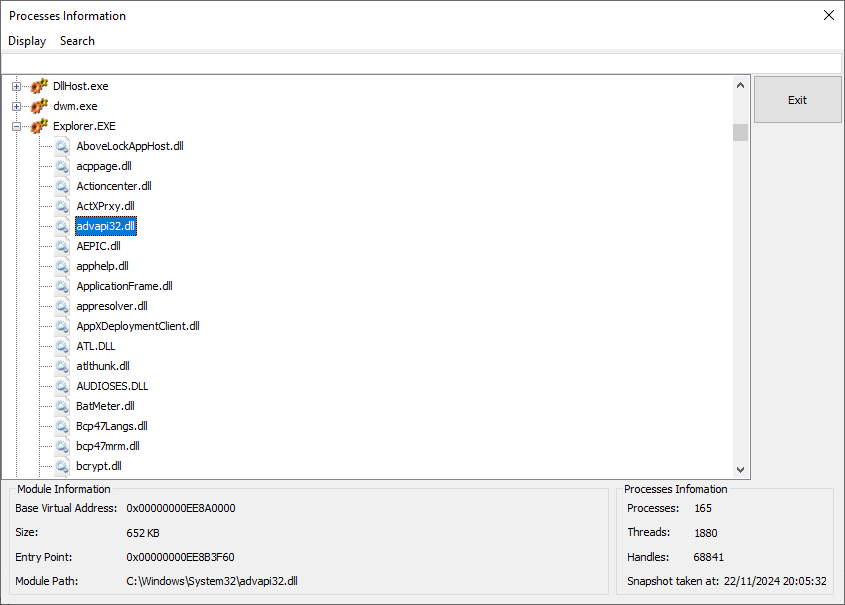

# ProcessInformation

Process information is a small program that can:

* Display information about currently running processes;
* Display the DLL (dynamically linked libraries) loaded by a process;
* Display the load address, entry point and the file path to each DLL and executable;
* Search for processes and DLLs that include certain memory address;

## Installation

Open the solution file `*.sln` with visual studio. Follow the build process for visual studio project.

Windows 7 and newer: The project is configured to require administrator access by default, because it needs debug privileges.

## Changelog

2009-11-27: Migrated to x64 version (with 16 hex addresses);
2024-11-22: Migrated the solution to Visual Studio 22;
